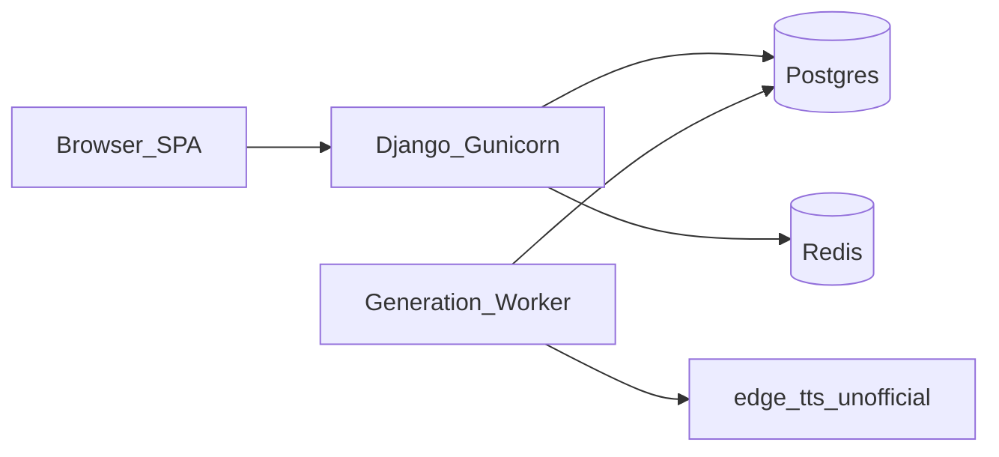

# ARCHITECTURE.md — Libro.UZ

High-level architecture notes for operators and developers. Product overview lives in [`PROJECT_OVERVIEW.md`](PROJECT_OVERVIEW.md); deploy/run details in [`DEPLOY.md`](DEPLOY.md) and [`README.md`](README.md).

## Stack shape

- **Django monolith** — APIs, admin, gated media, SPA static serving (`FRONTEND_DIST`).
- **React SPA (Vite)** — catalog, auth, reader (flip / PDF / listen).
- **Generation worker** — `process_generation_jobs --loop` for PDF + TTS jobs (`GenerationJob`).

## TTS Provider Risk

### What we use today

Narrated audio is produced by the **`edge`** provider (`library/tts_providers/edge.py`), which wraps the community **`edge-tts`** package. That package talks to an **unofficial** Microsoft Edge online TTS endpoint — not a contracted Azure Speech (or similar) API.

### Operational risk

| Risk | Implication |
|------|-------------|
| Unofficial / ToS | Endpoint may change, throttle, or block clients without notice |
| Single provider | TTS outages block new listen audio until jobs succeed or fail terminal |
| Network dependency | Worker needs outbound HTTPS; timeouts and transient errors are expected |

Mitigations in this codebase (not a second provider):

- Per-attempt timeout (120s) and **retry/backoff** inside `EdgeTTSProvider.synthesize`
- Job-level retries (`GenerationJob.max_attempts`, default 3)
- Book `audio_generation_status` stays `generating` during retries; becomes `failed` only on **terminal** job failure (surfaced in `GET /health/generation/` via `failed_recent_24h` / `last_failed`)

### Extension point for a second provider

1. Add a module under [`backend/library/tts_providers/`](backend/library/tts_providers/) implementing `TTSProvider.synthesize`.
2. Wire it in `get_tts_provider()` based on `TTS_PROVIDER`.
3. Set `TTS_PROVIDER` in the environment (unknown values raise `NotImplementedError` with guidance).

Do **not** treat edge-tts as a hard production SLA until a supported commercial provider is available or risk is explicitly accepted.
