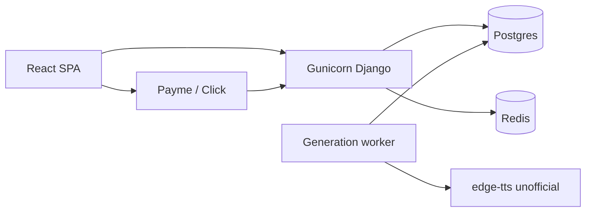

# PROJECT_ANALYSIS.md — Libro.UZ comprehensive audit

**Role:** Senior Software Architect & Security Consultant
**Scope:** Full repository (backend, frontend, e2e, deploy, CI, docs). Read-only; no production code was changed.
**Date:** 16 August 2026
**Product name (from code/docs):** Libro.UZ — a digital Uzbek bookstore / reading platform (not a physical-lending ILS).

This is a critical audit. Strengths are real; remaining gaps are called out with file evidence. No Critical-severity exploitable defects (auth bypass, SQL injection, committed live secrets) were found. Several **High** operational, commercial, and CI risks remain.

---

## 1. Project Overview

### Tech stack

| Layer | Technology | Version / evidence |
|--------|------------|-------------------|
| Language (API) | Python | 3.12 in `Dockerfile` and `.github/workflows/ci.yml`; lockfile header notes pip-compile on 3.14 |
| Web framework | Django | `django==6.0.7` in `requirements.lock.txt`; range `Django>=6.0.7,<7.0` in `requirements.txt` |
| API | Django REST Framework | `djangorestframework==3.17.1` |
| Auth tokens | SimpleJWT + blacklist | `djangorestframework-simplejwt==5.5.1`; app `rest_framework_simplejwt.token_blacklist` in `backend/backend/settings.py` |
| WSGI | Gunicorn | `gunicorn==23.0.0`; Compose `--workers 2` |
| DB (prod-like) | PostgreSQL 16 | `postgres:16-alpine` in `docker-compose.yml` |
| DB (local/CI/E2E) | SQLite | default when `DATABASE_URL` unset (`settings.py`) |
| Cache | LocMem (dev) / Redis 7 (prod) | `CACHES` in `settings.py`; `redis:7-alpine` in Compose |
| Static | WhiteNoise | compressed storage when `DEBUG=False` |
| Frontend | React 19 + TypeScript ~5.8 + Vite 8 | `frontend/package.json` |
| Reader | `page-flip`, `pdfjs-dist` | same file |
| E2E | Playwright 1.62.0 | root `package.json` |
| Node | 22.22.0 | `.nvmrc`, `engines` |
| TTS | `edge-tts` (unofficial Edge endpoint) | `library/tts_providers/edge.py`, `ARCHITECTURE.md` |
| Payments | Payme Merchant API + Click Shop API | `backend/payments/` |
| HTML sanitization | bleach 6.4.0 | `library/body_sanitize.py` |
| Images | Pillow 12.x | `requirements.txt` |

There is **no** `django-cors-headers` in `requirements.txt` / `requirements.lock.txt`. The SPA is same-origin in Docker (`FRONTEND_DIST`) and same-origin in local Vite via proxy (`frontend/vite.config.js`).

### Project type and purpose (from code, not marketing)

This is a **digital catalog + immersive reader + optional paid entitlement** product:

- Public shelf of **published** books with Uzbek `BookTranslation` body.
- Authenticated reading (flip HTML, PDF stream, listen/TTS).
- Entitlement: `rights_status == public_domain` is free; otherwise a `Purchase` with `status=paid` is required (`library/access.py` → `user_can_access_book`).
- Optional Payme/Click checkout creating `PaymentTransaction` then fulfilling `Purchase` (`payments/entitlement.py`).
- Staff publishing, rights gates, PDF/TTS **generation worker**, reviews, notifications, reading goals.

It is **not** a classic library ILS (no physical copies, loans, barcodes, or fines). Django admin is the operator console (`/admin/`).

### High-level architecture

```text
fullstack02-django/
├─ backend/                 Django project
│  ├─ backend/              settings.py, urls.py, wsgi
│  ├─ library/              catalog, reader APIs, media, jobs, reviews, notifications
│  ├─ users/                JWT-cookie auth, preferences
│  ├─ payments/             checkout + webhooks + entitlement bridge
│  └─ templates/legal/      terms, privacy, rights-report HTML
├─ frontend/src/            React SPA (pages, api, auth, reader)
├─ e2e/                     Playwright
├─ deploy/                  nginx TLS examples
├─ Dockerfile               Node build → Python runtime + SPA dist
└─ docker-compose.yml       web, worker, db, redis, migrate
```

**Layers**

1. **Browser** — React SPA (`frontend/src/App.tsx`). Production: Gunicorn serves `index.html` when `FRONTEND_DIST` is set (`backend/backend/urls.py` `_spa_index`).
2. **API / HTML** — DRF JSON under `/api/*`; gated files under `/library/media/<slug>/…`; Django admin; legal pages.
3. **Worker** — `process_generation_jobs --loop` (`docker-compose.yml` `worker` service).
4. **Data** — Postgres (Compose) or SQLite (local); Redis for shared cache/throttles when `DEBUG=False`.



---

## 2. Functional Summary

### Implemented features / modules

| Module | What exists | Primary evidence |
|--------|-------------|------------------|
| Auth | Register, login, logout, CSRF cookie, JWT refresh, password reset | `users/views.py`, `users/urls.py` |
| Catalog | Search `q`, category filter, pagination (24), category shelves | `library/catalog_context.py`, `CatalogAPIView` |
| Book detail | Similar books, ratings aggregate, purchase flags | `library/api/books.py` `BookDetailAPIView` |
| Reader | Flip, PDF, listen; progress heartbeats | `BookReaderManifestAPIView`, `frontend/src/pages/ReaderPage.tsx` |
| Entitlement | Public domain vs paid `Purchase` | `library/access.py`, `media_views.py` |
| Media gate | PDF/audio **not** on open `/media/books/` | `backend/urls.py` comment + cover-only `serve` |
| Generation | PDF (ReportLab) + TTS queue | `library/jobs.py`, `GenerationJob` |
| Reviews | CRUD, pagination 20 | `library/api/reviews.py` |
| Notifications | List, mark one/all read | `library/notification_views.py` |
| Activity | Daily goal, streak, badges | `library/activity.py`, `UserPreferences` |
| Payments | Checkout, status, Payme webhook, Click prepare/complete | `payments/views.py` |
| Legal | Terms, privacy, rights-report form | `library/legal_views.py` |
| Ops health | Staff-only generation JSON | `library/health_views.py` `GenerationHealthView` |
| Admin | Books, purchases (mark paid), reviews, jobs, payments read-only | `library/admin.py`, `payments/admin.py` |

**Payments are implemented** in code. `FOLLOWUP.md` still says commerce is "admin-marked only" and "out of scope" — that document is **stale** and should not be trusted as current architecture.

### Entry points

| Entry | Path |
|--------|------|
| SPA (prod) | `/`, `/library/…`, `/login`, `/register`, `/password-reset/…`, `/payment/status/<uuid>/` via `_spa_index` |
| SPA (local) | Vite `:5173`; Django `:8000` APIs; `vite.config.js` proxies `/api`, `/library` media, `/media`, `/admin`, `/static` |
| Admin | `/admin/` |
| Auth API | `/api/register/`, `/api/login/`, `/api/logout/`, `/api/csrf/`, `/api/me/`, `/api/preferences/`, `/api/token/refresh/`, `/api/password-reset/`, `/api/password-reset/confirm/` |
| Library API | `/api/library/` catalog; `/api/library/my/`; `/api/library/<slug>/`; `/reader/`; `/progress/`; `/status/`; `/reviews/` |
| Notifications | `/api/notifications/`, `…/<id>/read/`, `…/read-all/` |
| Payments | `/api/payments/checkout/`, `/api/payments/transactions/<uuid>/`, `/api/payments/payme/webhook/`, `/click/prepare/`, `/click/complete/` |
| Gated files | `/library/media/<slug>/pdf/`, `…/audio/`, `…/audio/<chapter_id>/` |
| Health | `/health/generation/` (JWT + `is_staff`) |
| Rights | `GET /rights-report/`, `POST /api/rights-report/` |

`ROOT_URLCONF` is `backend.urls` (`settings.py`).

### Data models / schema summary

**`library.Book`** — slug, cover, PDF/audio files, generation statuses, `author_name`, `category` (indexed), `rights_status` (indexed), `is_published`, timestamps. Publish `clean()` requires public_domain or licensed, Uzbek translation, and PDF+audio ready/legacy.

**`BookTranslation`** — unique `(book, language)`; currently only `uz`. `body` sanitized with bleach on `clean()`/`save()`. Optional `audio_sync` JSON.

**`AudioChapter`** — unique `(book, order)`; TTS metadata.

**`ReadingProgress`** — unique `(user, book)`; status planned/reading/finished; mode flip/pdf/listen; index `user, status, -updated_at`.

**`ReadingSession`** — unique `(user, date)`; minutes/pages.

**`Purchase`** — unique `(user, book)`; pending/paid/refunded; `on_delete=PROTECT`.

**`Review`** — unique `(user, book)`; rating 1–5; text ≤ 2000.

**`Notification`** — types audio_ready / purchase_paid / purchase_refunded; index `user, is_read, -created_at`.

**`GenerationJob`** — partial unique active `(book, job_type)` while queued/running.

**`payments.PaymentTransaction`** — UUID PK; amount in **tiyin** snapshotted at checkout; partial unique active `(user, book)` while created/pending; index `(provider, provider_transaction_id)` — **not a uniqueness constraint**.

**`users.UserPreferences`** — OneToOne daily goal 5–300 minutes.

Auth users are stock **`django.contrib.auth.models.User`** (no custom user model).

---

## 3. Code Quality Assessment

### Naming and style

Generally consistent: Django apps `library` / `users` / `payments`; React pages `*Page.tsx`; API helpers `serialize_book_card`. Uzbek UI copy is intentional (`LANGUAGE_CODE = 'uz'`). Mixed English (code/docs) and Uzbek (product strings) is coherent.

Dense modules: `users/views.py`, `payments/providers/payme.py`, `library/api/progress.py`, `frontend/src/lib/reader/flipPagination.ts`. Maintainable, but high cognitive load.

### Comments and documentation

Above average for a product repo: `README.md`, `ARCHITECTURE.md`, `DEPLOY.md`, `PAYMENTS.md` (referenced), `.env.example`, module docstrings on security-sensitive views (webhook CSRF-exempt rationale in `payments/views.py`).

Problems:

- `FOLLOWUP.md` contradicts implemented payments.
- `CookieTokenRefreshAPIView` has no docstring on missing throttle.
- Dead helper in `library/api/catalog.py` is undocumented as dead.

### Duplication and dead code

| Issue | Evidence |
|--------|----------|
| Duplicate similar-books helper | Working copy: `library/api/books.py` `_serialize_similar_books`. Dead copy: `library/api/catalog.py` lines 199–225 uses `Book` and `DISPLAY_LANG` **without imports** — `NameError` if ever called. Catalog view never calls it. |
| `serialize_review` thin wrapper | `library/api/_common.py` just delegates to `ReviewSerializer`. Harmless. |
| Legacy Django auth pages | Redirect-only views in `users/views.py` (`RegisterPageView`, etc.) — fine for dual-stack. |

### Error handling and validation

**Strong**

- DRF serializers for register/login (`users/serializers.py`): password validators, disposable-email denylist (small), username/email uniqueness.
- Progress upsert: `ProgressUpsertSerializer.to_internal_value` clamps types; invalid `status` → 400 (`library/api/progress.py`).
- Reviews: rating 1–5, text max 2000 (`ReviewWriteSerializer`).
- Checkout: published book, provider enum, purchasable rights, `select_for_update` reuse of active txs (`CheckoutAPIView`).
- Password reset: always 200; SMTP failures logged (`PasswordResetRequestAPIView`).
- Production boot guards: weak `SECRET_KEY`, `ALLOWED_HOSTS=*`, CSRF wildcards, missing `REDIS_URL`, console email, payment creds (`settings.py`).

**Weak**

- `CookieTokenRefreshAPIView.post` uses bare `except Exception` around serializer validation (`users/views.py`) — swallows unexpected bugs into 401.
- `RightsReportAPIView` does not use `EmailField`; any string ≤ 200 chars is accepted.
- `ReadingProgressAPIView` does **not** call `user_can_access_book` — any authenticated user can write progress for any published slug.
- `ReviewAPIView` POST does not require purchase or that the user has opened the book.

### Test coverage

**Present and relatively serious**

- Django: `library/test_*.py`, `users/tests.py`, `backend/test_settings_guards.py`, `library/test_catalog_perf.py`, XSS/verification tests, media range tests.
- Payments: rich unit suite under `backend/payments/tests/` (signatures, idempotency, checkout, entitlement).
- Frontend: Vitest + Testing Library across reader, reviews, catalog pieces (`frontend/package.json` `vitest run`; CI `frontend-tests`).
- E2E: 11 Playwright specs including `e2e/reader-xss.spec.ts`, `e2e/entitlement.spec.ts`.
- CI also: typecheck, pip-audit high+, npm audit high+.

**Gaps**

- **CI backend job does not run the `payments` app:**

```64:64:.github/workflows/ci.yml
        run: python manage.py test library users backend --verbosity=1
```

  Money-path tests only run if a developer remembers `manage.py test payments`. That is a **High** process failure for a checkout system.

- E2E payments are **mocked** (`e2e/payment-checkout.spec.ts` documents no real gateway).
- No coverage percentage gate (coverage.py / c8 not in CI).
- `backend/scripts/test_*.py` are not in the CI `manage.py test` invocation.

---

## 4. Security Audit

### Authentication and authorization

**Model:** HttpOnly JWT cookies (`access_token` 15 minutes, `refresh_token` 30 days), rotation + blacklist (`SIMPLE_JWT` in `settings.py`). Cookies: `JWT_COOKIE_HTTPONLY = True`, `Secure` when not DEBUG, `SameSite=Lax` (`users/auth.py` `set_jwt_cookies`).

DRF default: `JWTCookieAuthentication` + `IsAuthenticated` (`REST_FRAMEWORK`). Public endpoints explicitly set `AllowAny`.

**CSRF:** DRF does not run Django CSRF on `APIView`. Writes that use cookies call `CSRFEnforcedAuthentication`, which delegates to `SessionAuthentication.enforce_csrf` (`users/authentication.py`). SPA sends `X-CSRFToken` from the `csrftoken` cookie (`frontend/src/api/client.ts`). `GET /api/csrf/` sets the cookie (`CsrfAPIView`).

**Media/staff HTML** uses `AuthRequiredMixin` / `ensure_request_user` — **JWT cookie only, no Django session fallback** (`library/auth_access.py`). Correct for a JWT-SPA.

**Entitlement on bytes:** `BookPdfMediaView` / audio views check `is_published` and `user_can_access_book` (`library/media_views.py`). Covers are public by design (`backend/urls.py` `_cover_patterns`).

**Authorization gaps (not full bypass):**

| Gap | Detail |
|-----|--------|
| Public-domain still requires login to stream | `AuthRequiredMixin` runs before the public-domain short-circuit. Product choice, not a leak. |
| Book detail API is login-walled | `BookDetailAPIView` `IsAuthenticated`; catalog is public. Summaries still leak via catalog cards. |
| Progress / reviews uncoupled from purchase | Shelf and ratings can be abused without buying. |
| `is_staff` in JSON | `/api/me/` and catalog `user` payload expose staff flag — useful for UI, slightly aids recon. |
| Admin mark-paid | `PurchaseAdmin.action_mark_as_paid` can grant entitlement without a gateway; it **logs a warning** with actor id. Appropriate only if staff are trusted. |

Django admin remains session-auth (standard). Protect `/admin/` at the edge (IP allowlist / VPN) — nginx sample does not.

### Password storage

(Truncated in original view — Django default PBKDF2 hasher noted as Low-severity item in Weaknesses table: "PBKDF2 not Argon2".)

### Secrets

| Secret | Handling |
|--------|----------|
| Merchant keys | Env-only; required when `PAYMENTS_ENABLED` and not DEBUG |

No live API keys were found in tracked source. Operators can still ship Compose with `ENVIRONMENT=staging` default (`docker-compose.yml`) and accidentally enable console email if they set `ALLOW_CONSOLE_EMAIL=1`.

### CORS, CSRF, rate limiting

- **CORS:** Not configured; not needed for current same-origin + Vite proxy design. A future split API origin would need an explicit allowlist (do not add `CORS_ALLOW_ALL_ORIGINS`).
- **CSRF:** `CSRF_TRUSTED_ORIGINS` required; wildcards rejected at startup.
- **Throttles (scoped only):** `auth` 5/min, `password_reset` 5/min, `rights_report` 5/hour, `review_write` 10/min, `reading_progress` 30/min, `payment_checkout` 10/min (`settings.py`). **`DEFAULT_THROTTLE_CLASSES` is unset** — unscoped views (catalog GET, `/api/me/`, reader manifest, notifications, webhooks, token refresh) have **no** DRF throttle.
- **E2E_RELAX_THROTTLE** cannot apply when `DEBUG=False` (ImproperlyConfigured).
- **Prod Redis:** required so throttles are not per-Gunicorn-process.

**Missing throttle on `CookieTokenRefreshAPIView`:** refresh tokens are unguessable, so this is not a brute-force of the token itself; it is still a **resource / rotation-abuse** gap (no `throttle_scope`).

Webhooks are `csrf_exempt` + `AllowAny` with provider auth (Payme Basic `hmac.compare_digest`, Click MD5 `hmac.compare_digest`). Correct for those protocols. **No rate limit** → webhook flooding / CPU DoS.

Click **MD5** is the vendor protocol, not a project mistake; treat as inherent gateway weakness.

### Dependency vulnerabilities

Policy is mature: `scripts/ci_pip_audit_high.py` + `npm audit --audit-level=high` on every PR; weekly advisory workflow. This audit did not execute pip-audit against the live OSV API; **do not assume zero CVEs** — rely on CI. `edge-tts` / `aiohttp` chain is a moving target.

Lockfile vs `requirements.txt` ranges is the right pattern. Frontend `overrides.postcss` shows they already patch transitive issues.

### File uploads

Uploads are **staff/admin FileFields**, not public user uploads.

| Field | Checks (`library/validators.py`) |
|--------|-----------------------------------|
| Cover | jpg/jpeg/png/webp, 5 MB, Pillow `verify()` |
| PDF | `.pdf`, 50 MB, `%PDF-` magic |
| Audio | mp3/m4a/ogg/wav, 100 MB, **no magic-byte / content check** |

Nginx example `client_max_body_size 32m` vs PDF max **50 MB** — large admin PDF uploads can fail at the proxy before Django validators run.

### Session / token management

| Control | Implementation |
|---------|----------------|
| Access TTL | 15 minutes |
| Refresh TTL | **30 days** — long-lived stolen refresh = long account takeover until rotation/blacklist |
| Rotation | `ROTATE_REFRESH_TOKENS` + `BLACKLIST_AFTER_ROTATION` |
| Logout | `RefreshToken.blacklist()` + `clear_jwt_cookies` + optional `django_logout` |
| Header vs cookie | `JWTCookieAuthentication` prefers `Authorization` if present |
| SPA refresh | `apiFetch` retries once on 401 via `POST /api/token/refresh/` (`client.ts`) |

No reuse-detection beyond blacklist (no family/device list). No step-up auth for purchase.

### Other security notes

- JSON-only DRF renderers — browsable API disabled (smaller CSRF/HTML surface).
- `XFrameOptionsMiddleware` present; no custom `SECURE_CONTENT_TYPE_NOSNIFF` override (Django SecurityMiddleware still applies).
- No CSP, Referrer-Policy, or Permissions-Policy in Django.
- Production TLS: `SECURE_SSL_REDIRECT`, HSTS, secure cookies when `USE_TLS` (`settings.py`).
- Generation rights gate: `book_allows_generation` (`jobs.py`).
- `PaymentTransaction.raw_payload` stores webhook JSON — treat as sensitive in DB backups/admin (admin is read-only, still visible to staff).
- Entitled users receive **full `body` JSON** on `BookReaderManifestAPIView` and can download PDF/audio. There is **no watermarking or DRM**. For licensed paid books this is a commercial-content risk, not a bug.

---

## 5. Performance & Scalability

### Database queries and indexes

**Good**

- Catalog prefetch translations + `audio_chapters`; review aggregates annotated (`published_books_queryset`).
- Category shelves cached 60s as JSON-safe ids (`CATEGORY_SHELVES_CACHE_KEY` v3); invalidated on `Book.save()`.
- Search query truncated to 200 chars.
- Batched `paid_book_ids_for_user` on catalog/my-library (`access.py`).
- `test_catalog_perf.py` guards query counts.
- Indexes on progress, notifications, payment provider+ptid, generation job status.

**Weak**

- Search is `icontains` (leading-wildcard) — will not use B-tree indexes; no Postgres `SearchVector` / trigram.
- `MyLibraryAPIView` loads **all** progress rows per status with no pagination (`library/api/catalog.py`).
- `compute_streak_days` / `_active_day_keys` may load many `updated_at` values as the library grows (`activity.py`).
- `Book.get_translation` builds a dict from `translations.all()` — fine with prefetch; N+1 if prefetch forgotten.
- Duplicate `.distinct()` on catalog queryset after `icontains` across translations — correct but extra work.

### Caching

- Redis required in production for throttles and regenerate quotas (`check_regenerate_quota` uses cache).
- Catalog shelf cache only — **no** HTTP cache headers / CDN strategy for API JSON.
- LocMem in DEBUG is correct for single-process runserver.

### API shape and pagination

| Endpoint | Pagination |
|----------|------------|
| Catalog shelf | Yes, 24 (`PAGE_SIZE`) |
| Reviews GET | Yes, 20 (`REVIEW_PAGE_SIZE`) |
| Notifications | DRF `PageNumberPagination` page_size 20 |
| My library | **None** |
| Continue reading | Cap 12 |
| Activity timestamps | Cap 50 |

Catalog response is a **fat dashboard payload** (shelves + continue + activity + user) — fine at small catalog size; will bloat.

### Frontend bundle / lazy loading

`App.tsx` **statically imports** every page including `ReaderPage` (pulls pdf.js + page-flip). There is **no `React.lazy` / `Suspense`**. For a reader-heavy SPA this is the main frontend performance issue.

Production SPA assets are served with `django.views.static.serve` on `^assets/` when `FRONTEND_DIST` is set (`backend/urls.py`) — **not** WhiteNoise. That is inefficient and is discouraged by Django for production file serving (Gunicorn workers blocking on disk).

Gunicorn `--workers 2` with in-process PDF streaming will not scale to many concurrent readers; put media behind nginx `X-Accel-Redirect` or object storage later.

---

## 6. Strengths

1. **Entitlement-aware media URLs** — anonymous catalog cards get empty audio/PDF URLs (`Book.get_audio_chapters_payload(include_urls=…)`, `serialize_book_card`).
2. **Production configuration fail-closed** — weak secrets, wildcard hosts, missing Redis, console email, incomplete payment creds cannot boot with `DEBUG=False`.
3. **Cookie JWT + CSRF** implemented deliberately, with E2E throttle relax locked to DEBUG.
4. **Payments engineering quality** — amount snapshot, `select_for_update`, idempotent `fulfill_paid_transaction` / `revoke_paid_transaction`, constant-time compares, payload redaction logger, Click decimal amount matching.
5. **Rights gating for TTS/PDF** — cannot generate or publish without clearance (`Book.clean`, `enqueue_generation_job`).
6. **XSS attention** is real (bleach, escapeHtml, Playwright XSS spec), not checkbox comments.
7. **SQLite hardened for local concurrency** — WAL, IMMEDIATE, timeout 30 (`settings.py`) — shows operational awareness.
8. **CI culture** — lockfile hashes, pip-audit, npm audit, typecheck, Vitest, Playwright as a separate required job.
9. **Same-origin production SPA** avoids CORS footguns.
10. **Clear worker split** — generation is not on the request path.

---

## 7. Weaknesses & Risks

| Severity | Issue | Evidence |
|----------|--------|----------|
| **Critical** | None identified (no auth bypass, SQLi, or committed live secrets). | Full-pass review of auth, ORM, media routing, gitignore. |
| **High** | Payment unit tests excluded from CI `manage.py test` | `.github/workflows/ci.yml` `library users backend` omits `payments` |
| **High** | Payme `GetStatement` returns an empty list | `PaymeProvider._statement` in `payments/providers/payme.py` (~448–450) — merchant reconciliation / certification risk |
| **High** | Production TTS depends on unofficial `edge-tts` | `tts_providers/__init__.py`, `ARCHITECTURE.md` — ToS, breakage, no SLA |
| **High** | Licensed book bytes/text are fully exfiltratable after purchase | Manifest `body` + ungated-once-entitled PDF/audio; no watermark |
| **High** | 30-day refresh cookie is a long-lived session | `REFRESH_TOKEN_LIFETIME` in `settings.py` |
| **Medium** | No CSP / modern browser hardening headers | `settings.py`, `deploy/nginx.conf` |
| **Medium** | Unthrottled catalog, refresh, webhooks, `/api/me/` | No `DEFAULT_THROTTLE_CLASSES`; refresh view has no `throttle_scope` |
| **Medium** | Dead `NameError` helper in catalog API module | `library/api/catalog.py` `_serialize_similar_books` |
| **Medium** | Audio uploads lack content sniffing | `audio_file_validators` vs PDF/image validators |
| **Medium** | SPA `assets/` via `django.views.static.serve` + no route-level code splitting | `backend/urls.py`, `App.tsx` |
| **Medium** | Account enumeration on register; tiny disposable-email list | `RegisterSerializer` |
| **Medium** | Reviews/progress without entitlement | `ReviewAPIView`, `ReadingProgressAPIView` |
| **Medium** | Single global `BOOK_PRICE_TIYIN` | `settings.py` / `payment_service.py` — no per-book price |
| **Medium** | `provider_transaction_id` not unique | `PaymentTransaction.Meta` index only |
| **Medium** | Docs drift (`FOLLOWUP.md`) | Claims payments unimplemented |
| **Medium** | Nginx 32m vs PDF 50MB | `deploy/nginx.conf` vs `PDF_MAX_BYTES` |
| **Low** | PBKDF2 not Argon2 | default Django hasher |
| **Low** | `is_staff` in public-ish API payloads | `MeAPIView`, `CatalogAPIView` |
| **Low** | Streak queries not indexed for "all timestamps" | `activity.py` `_active_day_keys` |
| **Low** | No Sentry/OpenTelemetry | no matches in lockfile/settings |
| **Low** | Compose `ENVIRONMENT` defaults to `staging` | `docker-compose.yml` |
| **Low** | Rights-report email not validated | `legal_views.py` |

---

## 8. Actionable Recommendations

### Quick wins (days)

1. **Change CI** to `python manage.py test library users payments backend` (or `manage.py test` with explicit excludes only for scripts).
2. **Delete** dead `_serialize_similar_books` from `library/api/catalog.py` (keep `books.py`).
3. **Throttle** `CookieTokenRefreshAPIView` (e.g. `auth` or a new `token_refresh` scope) and add a coarse throttle on webhooks (nginx `limit_req` is enough).
4. **Add CSP** (start Report-Only): `default-src 'self'`; pdf.js/worker and Vite assets will need explicit `script-src` / `worker-src`. Put it on nginx `add_header`.
5. **Validate** rights-report `email` with DRF `EmailField`.
6. **UniqueConstraint** on `(provider, provider_transaction_id)` where ptid ≠ `''`.
7. **Rewrite `FOLLOWUP.md`** so it matches Payme/Click reality.
8. Align nginx `client_max_body_size` with `PDF_MAX_BYTES` (or lower Django's PDF cap).
9. Add magic-byte / mutagen checks for audio in `validators.py`.
10. Stop serving `frontend/dist/assets` via `django.views.static.serve`; use WhiteNoise `WHITENOISE_ROOT` or nginx `alias`.

### Medium term (1–3 sprints)

11. Implement Payme `_statement` against `PaymentTransaction` time windows — required for serious merchant ops.
12. `React.lazy` for `ReaderPage` / `PdfReaderMode` so catalog users do not download pdf.js.
13. Paginate `MyLibraryAPIView`.
14. Postgres `pg_trgm` (or `SearchVector`) for catalog search; keep `MAX_SEARCH_QUERY_LENGTH`.
15. Require entitlement (or a "sampled chapter") for reviews; optionally require access for progress writes.
16. Per-book price on `Book` (fallback to `BOOK_PRICE_TIYIN`).
17. Switch password hasher to Argon2 (`django.contrib.auth.hashers.Argon2PasswordHasher`).
18. Shorten refresh TTL (7 days) or add "remember me" vs default 1-day refresh.
19. Add `DEFAULT_THROTTLE_CLASSES` with a generous `anon`/`user` rate for GET APIs.
20. Wire a second TTS provider (`TTS_PROVIDER`) as documented.

### Long-term / production hardening

21. Object storage + signed URLs or nginx auth_request for PDF/audio; optional watermarking for licensed titles.
22. Observability: Sentry (or OpenTelemetry) on Gunicorn + worker; alert on `GenerationHealthView` 503.
23. Real Payme/Click sandbox E2E behind `PAYMENTS_E2E=1`, not mocks.
24. Staff `/admin/` SSO or IP allowlist; consider 2FA (`django-otp`).
25. Custom user roles only if publishers appear; until then keep staff/superuser and document it (already in `FOLLOWUP.md` as a product decision).

### Suggested libraries (justification)

| Tool | Why |
|------|-----|
| `django-csp` or nginx CSP | Headers without scattering middleware mistakes |
| `argon2-cffi` | Memory-hard password hashing |
| `django-axes` or nginx auth limits | Extra brute-force layer beyond 5/min (optional) |
| `whitenoise` for SPA assets **or** nginx `alias` | Stop `static.serve` in prod |
| Azure Speech / Google TTS SDK | Replace unofficial Edge TTS |
| `pg_trgm` | Search without Elasticsearch at this scale |
| Sentry SDK | Worker + webhook failures are otherwise silent except logs |

---

## 9. Suggested Next Steps for Development

Given current state, the product is a **credible digital bookstore MVP**, not an unfinished tutorial. Next work should be **production-readiness of commerce and ops**, not more reader chrome.

### Build / improve next (priority order)

1. **Make payments operable:** CI includes `payments` tests; implement GetStatement; sandbox runbook drill; decide watermarking policy for licensed PDFs.
2. **TTS SLA:** second provider or explicit business acceptance of edge-tts outage.
3. **SPA performance:** lazy-load reader; serve assets via nginx/WhiteNoise.
4. **Catalog search UX:** trigram, maybe author facet; keep category pills.
5. **Trust & safety:** review moderation workflow is admin-only today — add report-review, rate limits on GET catalog if scraping appears.
6. **Notifications:** in-app only (`Notification` model). Add email for purchase paid / audio ready (`FOLLOWUP.md` still valid here).
7. **Observability and backups:** `DEPLOY.md` mentions backups; Compose has no backup job — add `pg_dump` cron before any real money.

### Missing features — mapped to this product (digital, not physical)

| Typical "library system" feature | Relevance here | Status |
|----------------------------------|----------------|--------|
| Search / filter | High | Basic `q` + category; no ranking |
| Admin panel | High | Django admin — adequate for ops, not a publisher CMS |
| Book reservation / holds | Low (no physical copies) | N/A unless you add pre-order |
| Fines / overdue | Low | N/A |
| Lending period / DRM checkout | High for licensed | Missing (unlimited download after pay) |
| Per-title pricing, discounts, coupons | High if selling | Missing (global tiyin) |
| Invoices / fiscal receipts | High in UZ commerce | Missing |
| Publisher / editor roles | Medium | Staff only |
| Recommendations | Medium | Similar-by-category only (`_serialize_similar_books`) |
| Offline reading | Medium | No |
| Accessibility (a11y) | Medium | Some ARIA; `backend/scripts/audit_a11y.py` exists as a script, not a CI gate |
| Multi-language catalog | Low until product asks | Uzbek-only by design |
| Email/push notification preferences | Medium | Missing |

Do **not** invest in barcode/circulation modules unless the product actually becomes a physical library. Invest in **paid-content protection, payment ops, TTS reliability, and CI that tests the money path**.

---

## Appendix — API surface (quick reference)

**Auth (`users/urls.py`)**
`RegisterAPIView`, `LoginAPIView`, `CsrfAPIView`, `MeAPIView`, `PreferencesAPIView`, `LogoutAPIView`, `CookieTokenRefreshAPIView`, `PasswordResetRequestAPIView`, `PasswordResetConfirmAPIView`.

**Library (`library/api_urls.py`)**
`CatalogAPIView`, `MyLibraryAPIView`, `ReadingProgressAPIView`, `ReadingStatusAPIView`, `BookReaderManifestAPIView`, `ReviewAPIView`, `BookDetailAPIView`.

**Payments (`payments/urls.py`)**
`CheckoutAPIView`, `TransactionStatusAPIView`, `PaymeWebhookAPIView`, `ClickPrepareAPIView`, `ClickCompleteAPIView`.

**Access core**
`user_can_access_book` / `user_has_access_to_book` / `paid_book_ids_for_user` in `library/access.py`.

---

*End of audit. This file is an independent assessment of the tree as of 16 August 2026; it does not replace `DEPLOY.md` runbooks or live CI audit output.*
