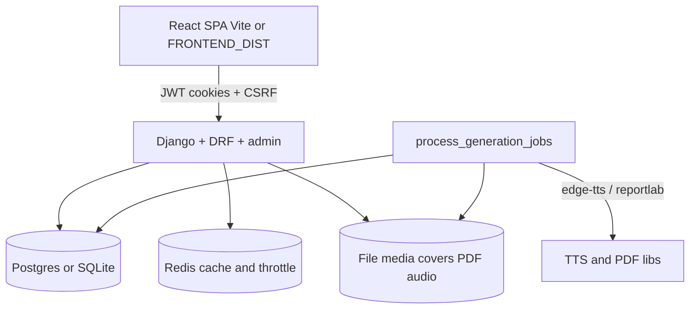
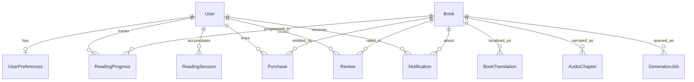

# PROJECT_OVERVIEW.md — Libro.UZ

> Self-contained handoff document for continuing development.  
> Generated from a read-only audit of the repository as of 2026-08-08.  
> Paths are relative to the repository root unless noted.

---

## 1. Project Summary

### What it is

**Libro.UZ** is a Uzbek-language digital library / bookstore web application. Users browse a published catalog, open immersive readers (flip-book, PDF, listen/TTS), track reading progress and daily goals, rate books, and receive notifications. Staff publish titles, clear rights, manage purchases (manual entitlements), and trigger PDF/TTS generation via Django admin.

**Kutubxona** in the product UI is the library surface (`/library`, sidebar labels in Uzbek). The brand name in admin and docs is **Libro.UZ**.

### Target users

| Audience | Capabilities |
|----------|----------------|
| **Anonymous visitors** | Browse catalog JSON, read public reviews, legal pages, register/login |
| **Authenticated readers** | Book detail, entitled reader + media streams, shelves (planned/reading/finished), reviews, notifications, preferences |
| **Staff / admins** | Django admin: books, translations, purchases, generation jobs, reviews moderation; generation health endpoint |

### Tech stack (exact versions from config / lockfiles)

| Layer | Technology | Version source |
|-------|------------|----------------|
| Language (backend) | Python | `.python-version` → **3.12** (lockfile generated with 3.14 tooling; runtime/Docker/CI use **3.12**) |
| Language (frontend) | TypeScript / JavaScript | Node **22.22.0** (`.nvmrc`, `engines` in root + frontend `package.json`) |
| Web framework | Django | **6.0.7** (`requirements.lock.txt`; constraint `Django>=6.0.7,<7.0`) |
| API | Django REST Framework | **3.17.1** |
| Auth tokens | djangorestframework-simplejwt | **5.5.1** (+ token blacklist app) |
| DB (local default) | SQLite 3 | `backend/db.sqlite3` with WAL + IMMEDIATE transactions |
| DB (Docker/prod) | PostgreSQL | Compose image **postgres:16-alpine**; driver **psycopg-binary 3.3.4** |
| Cache / throttle | Redis (optional local; required when `DEBUG=False`) | **redis 6.4.0** client; Compose **redis:7-alpine** |
| Images | Pillow | **12.3.0** |
| PDF generation | reportlab | **4.5.1** |
| TTS | edge-tts | **7.2.8** (provider `edge`; unofficial Microsoft Edge TTS) |
| HTML sanitize | bleach | **6.4.0** |
| Config | django-environ | **0.12.1** |
| Static in prod | whitenoise | **6.12.0** |
| WSGI server | gunicorn | **23.0.0** |
| Frontend | React | **^19.2.7** |
| Routing | react-router | **8.3.0** |
| Bundler | Vite | **^8.1.1** |
| PDF viewer | pdfjs-dist | **^4.10.38** |
| Flip book | page-flip | **^2.0.7** |
| Unit tests (FE) | Vitest + Testing Library | vitest **^3.2.4** |
| Lint (FE) | oxlint | **^1.71.0** |
| E2E | Playwright | **1.62.0** (root) |
| Package managers | pip + npm | `requirements.txt` / `requirements.lock.txt`; `package.json` + lockfiles |

Product orchestration: root `package.json` runs Django + Vite via `concurrently`.

---

## 2. Architecture Overview

### High-level shape

**Monolith:** one Django project (`backend/`) serves JSON APIs, auth-gated media, admin, legal HTML, and (in Docker/production) the built React SPA from `FRONTEND_DIST`. A separate **worker process** drains a DB-backed `GenerationJob` queue for PDF/TTS.



Local dual-stack: Vite on `127.0.0.1:5173` proxies `/api`, `/library` (media), `/media`, `/admin`, `/static` to Django on `127.0.0.1:8000`. Catalog/detail/reader HTML stays on the SPA via Vite `bypass` in `frontend/vite.config.js`.

### Top-level directory purposes

| Path | Purpose |
|------|---------|
| `backend/` | Django project root (`manage.py`, apps, templates, static, media, `.env`) |
| `backend/backend/` | Project settings, root URLconf, WSGI/ASGI |
| `backend/library/` | Core domain: books, reader APIs, media, jobs, notifications, legal |
| `backend/users/` | Auth APIs, JWT cookies, user preferences |
| `frontend/` | React 19 + Vite SPA |
| `e2e/` | Playwright cross-stack specs |
| `deploy/` | nginx TLS configs, self-signed cert helpers, Compose TLS overlay |
| `scripts/` | Dev helpers (free ports, backups, smoke/diag) |
| `.github/workflows/` | CI + weekly dependency audit |
| `ARCHITECTURE.md` | Short architecture note (entitlement + generation) |
| `README.md` | Operator quick start |
| `docker-compose.yml` / `Dockerfile` | Production-like stack |

### Key design patterns

- **API-first SPA:** React consumes DRF JSON; Django templates retained mainly for legal pages and legacy static assets.
- **Cookie JWT + CSRF:** Access/refresh in HttpOnly cookies; unsafe methods send `X-CSRFToken` (`users.authentication.CSRFEnforcedAuthentication`).
- **Entitlement gating:** `library.access.user_can_access_book` — public domain free; otherwise `Purchase(status=paid)`.
- **Gated media URLs:** Never expose raw `/media/books/...`; use `/library/media/<slug>/...` with JWT (`Book.gated_*` helpers in `library/models.py`).
- **Durable job queue:** `GenerationJob` rows + `manage.py process_generation_jobs`.
- **Signal enqueue:** `post_save` on Uzbek `BookTranslation` → schedule PDF+audio (`library/signals.py`).
- **Provider abstraction:** `TTS_PROVIDER` / `tts_providers/edge.py` behind `tts_service.py`.
- **Defense-in-depth XSS:** bleach on save (`body_sanitize.py`) + `escapeHtml` when building flip pages (`flipPagination.ts`).

### Frontend ↔ backend communication

| Mechanism | Usage |
|-----------|--------|
| **REST (JSON)** | `/api/library/…`, `/api/notifications/…`, `/api/…` auth |
| **Cookie credentials** | `fetch(..., { credentials: 'include' })` in `frontend/src/api/client.ts` |
| **Binary streams** | PDF/audio via `/library/media/…` (Range support for audio) |
| **HTML** | Legal pages; SPA shells when `FRONTEND_DIST` set |
| **WebSockets / GraphQL** | Not used (not found in codebase) |

---

## 3. Data Model / Database

### Engine & ORM

- **ORM:** Django ORM.
- **Local:** SQLite (`django.db.backends.sqlite3`) with `timeout=30`, `transaction_mode=IMMEDIATE`, WAL (`backend/backend/settings.py` ~103–126).
- **Compose/prod:** Postgres via `DATABASE_URL`.
- **Auth users:** Django built-in `auth.User` (not a custom user model). Case-insensitive unique email enforced via migration `users/migrations/0001_email_ci_unique.py`.

### Entities (library + users)

#### `library.Book`

| Field | Type | Notes |
|-------|------|--------|
| `slug` | SlugField unique | Auto from Uzbek title/author |
| `cover_image` | ImageField | `covers/`; validated |
| `pdf_file` | FileField | `books/pdf/` |
| `audio_file` | FileField | Legacy single track `books/audio/` |
| `pdf_source_hash` / `audio_source_hash` | CharField | Content hash for regen skip |
| `pdf_generation_status` / `audio_generation_status` | CharField | `pending\|generating\|ready\|failed\|legacy` |
| `pdf_generated_at` / `audio_generated_at` | DateTime | nullable |
| `author_name` | CharField | |
| `category` | CharField choices | science, fiction, novel, fantasy, history, biography, poetry, technology, philosophy, other |
| `rights_status` | CharField | `unset\|public_domain\|licensed\|pending_clearance` |
| `published_year` | PositiveSmallInteger | nullable |
| `is_published` | Boolean | Requires rights + Uzbek translation + PDF/audio ready/legacy |
| `created_at` / `updated_at` | DateTime | |

#### `library.BookTranslation` (1–N from Book; unique book+language)

| Field | Type | Notes |
|-------|------|--------|
| `book` | FK → Book | CASCADE |
| `language` | CharField | Currently only `uz` |
| `title` | CharField | |
| `summary` / `why_read` | TextField | optional |
| `body` | TextField | Bleach-sanitized on clean/save |
| `audio_sync` | JSONField | list of `{start,end,...}` timing objects |

#### `library.AudioChapter` (1–N from Book; unique book+order)

| Field | Type | Notes |
|-------|------|--------|
| `book` | FK | CASCADE |
| `title`, `order` | | Playback order |
| `audio_file` | FileField | |
| `duration_seconds` | PositiveInteger | nullable |
| `source_text`, `source_text_hash` | | TTS segment |
| `tts_provider`, `voice_id` | | default voice `uz-UZ-MadinaNeural` |
| `generated_at` | DateTime | |

#### `library.ReadingProgress` (unique user+book)

| Field | Type | Notes |
|-------|------|--------|
| `user` | FK auth.User | CASCADE |
| `book` | FK Book | CASCADE |
| `status` | | `planned\|reading\|finished` |
| `mode` | | `flip\|pdf\|listen` |
| `page`, `total_pages` | | flip/pdf |
| `chapter_id`, `position` | | listen (seconds) |
| `finished_at`, `updated_at` | | |

#### `library.ReadingSession` (unique user+date)

Daily minutes/pages for goals & streaks (`activity.py`).

#### `library.Purchase` (unique user+book)

| Field | Type | Notes |
|-------|------|--------|
| `status` | | `pending\|paid\|refunded` |
| `paid_at` | | set when marked paid |
| On save → paid | | `notify_purchase_paid` |

**No public payment gateway** — entitlements created/marked paid in admin.

#### `library.Review` (unique user+book)

`rating` 1–5, `text` ≤2000.

#### `library.Notification`

Types: `audio_ready`, `purchase_paid`. Fields: `message`, `is_read`, `link_url`, optional `book` FK.

#### `library.GenerationJob`

`job_type`: `pdf|audio|all`; `status`: `queued|running|done|failed`; lock fields; unique active (queued/running) per book+type.

#### `users.UserPreferences` (OneToOne → User)

`daily_goal_minutes` default 20, range 5–300.

### ER diagram (Mermaid)



### Migration note

Library migrations jump from `0019_notification` to `0021_readingsession` (no `0020_*` file in tree). Django accepts this as long as migration graph dependencies are consistent — do not invent a 0020 without checking dependency chains.

---

## 4. API Endpoints

Default DRF auth: `JWTCookieAuthentication`. Default permission: `IsAuthenticated` (overridden per view). Throttle scopes in `settings.REST_FRAMEWORK['DEFAULT_THROTTLE_RATES']`.

### Auth & user (`users/urls.py` → root)

| Method | Path | Auth | Throttle | Purpose / body / response |
|--------|------|------|----------|---------------------------|
| POST | `/api/register/` | AllowAny + CSRF | `auth` 5/min | Body: `username`, `email`, `password`, `password_confirm`, optional `next`. → 201 + user + JWT cookies |
| POST | `/api/login/` | AllowAny + CSRF | `auth` | Body: `username`, `password`, optional `next` |
| GET | `/api/csrf/` | AllowAny | — | Sets `csrftoken`; `{detail:"ok"}` |
| GET | `/api/me/` | AllowAny + JWT optional | — | `{authenticated, user\|null}` |
| GET/PUT | `/api/preferences/` | IsAuthenticated + CSRF | — | `{daily_goal_minutes}` |
| POST | `/api/logout/` | AllowAny + CSRF + JWT | — | Blacklist refresh; clear cookies |
| POST | `/api/token/refresh/` | AllowAny + CSRF | — | Refresh from cookie; rotate cookies |
| POST | `/api/password-reset/` | AllowAny + CSRF | `password_reset` | Body: `email` (always 200) |
| POST | `/api/password-reset/confirm/` | AllowAny + CSRF | `password_reset` | Body: `uid`/`uidb64`, `token`, `password`, `password_confirm` |

GET redirects (dual-stack): `/login/`, `/register/`, `/password-reset/`, `/password-reset/<uidb64>/<token>/` → SPA.

### Library JSON (`/api/library/` → `library/api_urls.py`)

| Method | Path | Auth | Throttle | Purpose |
|--------|------|------|----------|---------|
| GET | `/api/library/` | AllowAny + optional JWT | — | Catalog: shelves, pagination, continue reading, activity stats |
| GET | `/api/library/my/` | IsAuthenticated | — | My library by status counts + lists |
| GET | `/api/library/<slug>/` | IsAuthenticated | — | Book detail + similar + access flags |
| GET | `/api/library/<slug>/reader/` | IsAuthenticated | — | Reader manifest (403 if not entitled) |
| GET/PUT/POST | `/api/library/<slug>/progress/` | IsAuthenticated + CSRF | writes: `reading_progress` 30/min | Progress heartbeat / upsert |
| PUT/DELETE | `/api/library/<slug>/status/` | IsAuthenticated + CSRF | — | Shelf status; DELETE only `planned` |
| GET | `/api/library/<slug>/reviews/` | AllowAny | — | Paginated reviews |
| POST/PUT/DELETE | `/api/library/<slug>/reviews/` | IsAuthenticated + CSRF | `review_write` 10/min | CRUD own review |

**Book card keys** (typical): `slug`, `author_name`, `category`, `category_label`, `published_year`, `cover_url`, `has_pdf`, `has_audio`, `has_access`, `rights_status`, generation statuses, gated URLs (empty when anonymous/not entitled), `title`, `summary`, ratings, optional `progress` / `reading_status`.

**Progress payload:** `exists`, `status`, `mode`, `page`, `total_pages`, `chapter_id`, `position`, `updated_at`.

**Reader manifest:** `body`, `audio_sync`, `audio_chapters`, `pdf_url`, `audio_url`, `sentence_wrap`, `reading_progress`, etc. (`library/api/books.py` ~121–141).

### Notifications (`/api/notifications/`)

| Method | Path | Auth | Purpose |
|--------|------|------|---------|
| GET | `/api/notifications/` | IsAuthenticated | List + `unread_count` |
| POST | `/api/notifications/<id>/read/` | IsAuthenticated + CSRF | Mark one read |
| POST | `/api/notifications/read-all/` | IsAuthenticated + CSRF | Mark all |

### Legal & health

| Method | Path | Auth | Notes |
|--------|------|------|-------|
| GET | `/terms/`, `/privacy/`, `/rights-report/` | Public HTML | Django templates |
| POST | `/api/rights-report/` | AllowAny + CSRF | Throttle `rights_report` 5/hour; emails staff |
| GET | `/health/generation/` | JWT + **staff** | Queue health; 503 if worker likely down |

### Media (gated)

| Method | Path | Auth | Notes |
|--------|------|------|-------|
| GET | `/library/media/<slug>/pdf/` | JWT + entitlement | `FileResponse` PDF |
| GET | `/library/media/<slug>/audio/` | JWT + entitlement | Ranged legacy audio |
| GET | `/library/media/<slug>/audio/<chapter_id>/` | JWT + entitlement | Ranged chapter |
| GET | `/media/covers/<path>` | Public | Covers only — not book PDF/audio |

### Admin

| Path | Notes |
|------|--------|
| `/admin/` | Django admin (session auth for staff) |

---

## 5. Authentication & Authorization

### Login / register

1. SPA loads CSRF: `GET /api/csrf/`.
2. `POST /api/register/` or `/api/login/` with JSON + `X-CSRFToken`.
3. Server sets HttpOnly cookies via `users/auth.py` `set_jwt_cookies` — **tokens are not returned in JSON body**.
4. Passwords validated with Django’s validators; registration rejects disposable email domains (`users/serializers.py`).

### Session / token management

| Cookie | Settings | Lifetime |
|--------|----------|----------|
| `access_token` | HttpOnly, SameSite=Lax, Secure when not DEBUG | 15 minutes |
| `refresh_token` | same | 30 days; rotate + blacklist on refresh |
| `csrftoken` | Django default | — |

- Auth class: `JWTCookieAuthentication` — cookie or `Authorization: Bearer`.
- Media/staff HTML mixins use JWT cookie only (`library/auth_access.py`) — **no session fallback** for media.
- SPA auth APIs do not create Django sessions; logout still calls `django_logout` if a session exists.
- Frontend `apiFetch` retries once via `/api/token/refresh/` on 401 (`frontend/src/api/client.ts`).

### Roles & permissions

| Role | How identified | Permissions |
|------|----------------|-------------|
| Anonymous | no JWT | Catalog GET, reviews GET, legal, auth endpoints |
| Authenticated | valid access JWT | Detail, progress, my-library, notifications, preferences; reader/media if entitled |
| Staff | `user.is_staff` | Admin; `GET /health/generation/` |
| Superuser | Django flag | Full admin |

There is **no** custom RBAC framework / `IsAdminUser` on product APIs. Entitlement is **purchase/public-domain**, not role-based.

### Entitlement rules (`library/access.py`)

- `rights_status == public_domain` → access (for authenticated media/reader flows that already require login).
- Else → `Purchase` with `status=paid` for that user+book.
- Catalog may advertise `has_pdf` / `has_audio` without working URLs when not entitled.

---

## 6. Core Features & Modules

| Feature | Description | Key files | Status |
|---------|-------------|-----------|--------|
| **Catalog / Discover / Collections** | Home shelf, category grid (`toplamlar`), discover (`dokon`), search via catalog API | `library/api/catalog.py`, `catalog_context.py`, `HomePage.tsx`, `DiscoverPage.tsx`, `CollectionsPage.tsx` | **Complete** |
| **Book detail** | Cover, summary, similar books, launch modal, access flags | `api/books.py`, `BookDetailPage.tsx`, `ReaderLaunchModal.tsx` | **Complete** |
| **Immersive reader** | Flip (`page-flip`), PDF (`pdfjs`), Listen (chapters + sync) | `ReaderPage.tsx`, `Flip*`, `PdfReaderMode.tsx`, `AudioListenMode.tsx`, `useAudioPlayback.ts` | **Complete** (Django HTML reader removed) |
| **Reading progress & shelves** | planned/reading/finished; heartbeats; reopen | `api/progress.py`, `activity.py`, `MyLibraryPage.tsx` | **Complete** |
| **Weekly activity / goals** | Daily goal prefs, streaks, badges | `activity.py`, `UserPreferences`, `WeeklyActivityWidget.tsx` | **Complete** |
| **Reviews & ratings** | CRUD + dashboard widgets | `api/reviews.py`, `ReviewSection.tsx`, `useBookReviews.ts` | **Complete** |
| **Purchases / entitlements** | Manual admin Purchase; no checkout UI/API | `models.Purchase`, `access.py`, `PurchaseAdmin` | **Partial** — admin-only commerce |
| **Notifications** | audio ready / purchase paid | `notifications.py`, `notification_views.py`, `SidebarNotifications.tsx` | **Complete** |
| **PDF/TTS generation** | Jobs, worker, reportlab, edge-tts | `jobs.py`, `media_generation.py`, `pdf_service.py`, `tts_service.py`, `process_generation_jobs` | **Complete** for `edge`; other TTS providers not implemented |
| **Auth pages** | Login/register/reset SPA | `users/views.py`, `*Page.tsx`, `AuthContext.tsx` | **Complete** |
| **Legal** | Terms, privacy, rights report | `legal_views.py`, `templates/legal/*` | **Complete** |
| **Admin publishing** | Books, translations, regen actions, rights | `library/admin.py` | **Complete** |
| **E2E seed** | Deterministic fixtures | `seed_e2e.py`, `e2e/*` | **Complete** |
| **Payment gateway** | Stripe/Payme/etc. | — | **Not found / not implemented** |
| **Borrowing/fines/physical inventory** | Classic LMS | — | **Not applicable** (digital bookstore model) |

---

## 7. Dependencies

### Python — production (`requirements.txt` → pinned in `requirements.lock.txt`)

| Package | Pinned |
|---------|--------|
| Django | 6.0.7 |
| djangorestframework | 3.17.1 |
| djangorestframework-simplejwt | 5.5.1 |
| Pillow | 12.3.0 |
| django-environ | 0.12.1 |
| whitenoise | 6.12.0 |
| psycopg[binary] | psycopg-binary 3.3.4 |
| gunicorn | 23.0.0 |
| reportlab | 4.5.1 |
| edge-tts | 7.2.8 |
| redis | 6.4.0 |
| bleach | 6.4.0 |

Transitive notable deps (via lock): `aiohttp` (edge-tts), `asgiref`, etc.

**Dev / ops (not in requirements.txt):** Django test runner (stdlib+Django); optional `pip-audit` in CI workflow; Playwright/Node for E2E.

### JavaScript — frontend production

- `react`, `react-dom` ^19.2.7  
- `react-router` 8.3.0  
- `page-flip` ^2.0.7  
- `pdfjs-dist` ^4.10.38  

### JavaScript — frontend / root dev

- Frontend: Vite, Vitest, oxlint, TypeScript ~5.8, Testing Library, jsdom, `@vitejs/plugin-react`  
- Root: `@playwright/test` 1.62.0, `concurrently`, `cross-env`  
- Override: `postcss >= 8.5.23`

### Risk flags (observational)

| Item | Note |
|------|------|
| **edge-tts** | Documented in `.env.example` as unofficial; continuity risk for production marketing |
| **Weekly `dependency-audit.yml`** | `continue-on-error: true` — does **not** gate merges |
| **Live CVE scan** | Not run during this audit; run `pip-audit -r requirements.lock.txt` and `npm audit --prefix frontend` before release |
| **No django-cors-headers** | Intentional same-origin / proxy model (see Security) |

---

## 8. Configuration & Environment

### Environment variables (names only)

From `backend/backend/settings.py` + `backend/.env.example` + Compose:

| Variable | Configures |
|----------|------------|
| `SECRET_KEY` | Django secret (required; weak values rejected when `DEBUG=False`) |
| `DEBUG` | Debug mode (default False) |
| `ALLOWED_HOSTS` | Host allowlist (no `*` in production) |
| `DATABASE_URL` | Postgres (else SQLite) |
| `POSTGRES_DB` / `POSTGRES_USER` / `POSTGRES_PASSWORD` | Compose DB |
| `REDIS_URL` | Shared cache (required if `DEBUG=False`) |
| `REDIS_PASSWORD` | Compose Redis auth |
| `MEDIA_ROOT` / `STATIC_ROOT` | File paths |
| `FRONTEND_DIST` | Built SPA directory for same-origin serving |
| `SPA_ORIGIN` | Absolute SPA origin for emails/redirects (`same`/empty = relative) |
| `CSRF_TRUSTED_ORIGINS` | CSRF origins (no wildcards) |
| `E2E_RELAX_THROTTLE` | Raises auth throttle; **only with DEBUG=True** |
| `EMAIL_BACKEND` / `DEFAULT_FROM_EMAIL` / `EMAIL_HOST*` / `EMAIL_PORT` / `EMAIL_USE_TLS` | Mail |
| `ALLOW_CONSOLE_EMAIL` | Permit console email when not DEBUG (staging only) |
| `ENVIRONMENT` | Must be `staging` if console email under DEBUG=False |
| `RIGHTS_CONTACT_EMAIL` | Rights report recipient |
| `USE_TLS` | SSL redirect / HSTS / secure cookies |
| `SECURE_HSTS_SECONDS` / `SECURE_HSTS_PRELOAD` | HSTS |
| `TTS_PROVIDER` / `TTS_VOICE` | TTS (only `edge` implemented) |
| `GENERATION_MAX_RUNNING` | Worker concurrency cap |
| `GENERATION_REGENERATE_DAILY_LIMIT` | Staff regen quota |
| `GENERATION_STALE_QUEUED_SECONDS` | Health stale threshold |
| `SKIP_VITE_AUTOSTART` | Disable Vite subprocess from custom runserver |
| `VITE_DJANGO_ORIGIN` | Frontend build-time origin for absolute Django links (empty in Docker) |
| `E2E_VITE_ORIGIN` / `E2E_DJANGO_ORIGIN` | Playwright overrides |
| `BASE_URL` / `API_ORIGIN` / `AUDIT_BASE` | Script-only helpers |

### Local run

```bash
# backend/.env from .env.example; strong SECRET_KEY; DEBUG=True
pip install -r requirements.txt   # or requirements.lock.txt
cd backend && python manage.py migrate
cd frontend && npm install
# repo root:
npm install && npm run dev
# optional worker:
cd backend && python manage.py process_generation_jobs --loop
# open http://127.0.0.1:5173/library
```

### Docker

```bash
cp backend/.env.example backend/.env   # set secrets
docker compose --env-file backend/.env up --build
# http://127.0.0.1:8000/library — SPA via FRONTEND_DIST
```

Services: `db`, `redis`, `migrate`, `web` (gunicorn), `worker` (generation loop). TLS overlay: `deploy/docker-compose.tls.yml` + nginx.

### Tests

```bash
# Frontend
cd frontend && npm run typecheck && npm test && npm run lint
# Backend
cd backend && python manage.py test library users backend
# E2E
npm run test:e2e
```

---

## 9. Known Issues, TODOs, and Incomplete Work

### TODO / FIXME / HACK

**No `TODO`, `FIXME`, or `HACK` comments** were found in `*.py`, `*.ts`, `*.tsx`, `*.js`, `*.jsx`, `*.md`, `*.yml` during grep.

### Incomplete / deferred product work

| Item | Evidence |
|------|----------|
| **No online payment / checkout** | Purchases only via admin `PurchaseAdmin.action_mark_as_paid` (`library/admin.py` ~39–53) |
| **TTS providers beyond edge** | `.env.example` notes only `edge`; `TTS_PROVIDER` abstraction exists but no Azure/Google impl |
| **Referenced docs missing on disk** | See **Resolved in this pass** — `DEPLOY.md` / `FOLLOWUP.md` restored |
| **`SQLITE_LOCK_FIX_REPORT.md`** | Appeared in earlier git status as untracked; **not found** on disk at audit time — SQLite lock mitigations are instead documented in `settings.py` comments (~111–117) |
| **Legacy Django static CSS/JS** | `backend/static/library/css`, `users/js` still present alongside React ports — migration notes say SPA owns UI; risk of drift |
| **flipPagination comment** | `ReadingProgressPageHint` typed with “Phase 3” wording (`flipPagination.ts` ~30) though Phase 3 checklist in `MIGRATION_NOTES.md` is marked complete — stale comment only |
| **Migration numbering gap** | No `0020_*` between 0019 and 0021 |

### Placeholder UI (not incomplete features)

CSS/JS “placeholder” classes for missing covers (`shelf-card__placeholder`, etc.) and form `placeholder=` attributes — normal UI, not stubs.

### E2E credentials (local/CI only)

- Seed owner: `e2e_owner` / `E2e-Passw0rd!Strong` (`seed_e2e.py`, `e2e/fixtures.ts`)

---

## 10. Code Quality Observations

### Style & structure

- Library API cleanly split under `library/api/` with thin `api_views.py` re-export — good modularity.
- Large CSS ports (`frontend/src/assets/css/library.css` ~2000+ lines, `dashboard.css` ~1700+) — high maintenance cost; parallel copies under `backend/static/`.
- Large components: `ReaderLaunchModal.tsx` (~700 lines), `useAudioPlayback.ts` (~420 lines), `models.py` (~726 lines), `test_api.py` (~1200+ lines).
- Uzbek UI strings mixed with English code/comments — intentional product localization.
- Deprecated export kept for tests: `SETTINGS_KEY` in `flipPagination.ts` (~16–17).

### Duplication

- Auth form patterns shared via `authFormShared.tsx` (good).
- Cover placeholder markup repeated across `BookCard`, `ContinueReadingCard`, `ReaderLaunchModal`, detail page.
- Legacy Django static assets overlap React CSS/JS.

### Tests, lint, CI

| Layer | Present |
|-------|---------|
| Backend unit/integration | Extensive `library/test_*.py`, `users/tests.py`, `backend/test_settings_guards.py` |
| Frontend unit | Many `*.test.ts(x)` under `frontend/src` |
| E2E | Playwright suite in `e2e/` (auth, shelf, reader modes, entitlement, XSS, password reset) |
| Lint | `oxlint` (`frontend/.oxlintrc.json`); no project-wide Ruff/ESLint config required in package scripts (`.ruff_cache` may exist locally from tooling) |
| CI | `.github/workflows/ci.yml`: frontend typecheck+vitest, backend tests, Playwright e2e |
| Dependency audit | Weekly non-blocking workflow |

### Complexity hotspots

- Reader audio sync + progress heartbeats (`activity.py` caps, `useAudioPlayback.ts`).
- Catalog serialization + entitlement batching (`_common.py`, `paid_book_ids_for_user`).
- Generation worker concurrency / stale locks (`jobs.py`, `generation_health.py`).

---

## 11. Security Observations

**Read-only findings — not fixed in this audit.**

### Resolved in this pass

| Finding | Fix |
|---------|-----|
| **edge-tts unofficial / ToS risk** (mitigation, not second provider) | Provider retry/backoff in `tts_providers/edge.py`; book stays `generating` during job retries and becomes `failed` only on terminal `GenerationJob` failure (`jobs.py`); unknown `TTS_PROVIDER` → `NotImplementedError`; documented in `ARCHITECTURE.md` (TTS Provider Risk). |
| **Self-signed TLS material in repo** | Removed working-tree `deploy/certs/selfsigned.*` (never in git history); gitignore `deploy/certs/*.crt|*.key`; generate via `deploy/generate_selfsigned_cert.sh`. |
| **Missing DEPLOY.md / FOLLOWUP.md** | Restored `DEPLOY.md` (env, TLS, migrate, Redis, SMTP, backups, rollback) and `FOLLOWUP.md` (deferred work, payment left open/out of scope). |

### Positive controls

- Weak `SECRET_KEY` / wildcard `ALLOWED_HOSTS` / bad CSRF origins / missing Redis in prod / console email in prod → `ImproperlyConfigured` guards in `settings.py`.
- JWT HttpOnly cookies; refresh rotation + blacklist.
- CSRF enforced on unsafe DRF views using cookies.
- Book body sanitized with bleach (`body_sanitize.py` ~25–35); flip renderer escapes text (`escapeHtml` in `flipPagination.ts` ~117–120).
- Upload validators: extension, size, image verify, PDF magic (`validators.py`).
- Media not publicly served under `/media/books/`; covers only at `/media/covers/`.
- Auth throttle 5/min; password reset throttle; rights report throttle.
- Password validators enabled; disposable email blocklist.
- E2E throttle relax blocked when `DEBUG=False`.

### Issues / risks (with references)

| Finding | Location | Severity (qualitative) |
|---------|----------|------------------------|
| **No payment API — admin grants access** | `library/admin.py` Purchase actions | Operational: staff compromise = free content |
| **edge-tts unofficial / ToS risk** | See **Resolved in this pass** — mitigated with retries + docs; second provider still deferred | Continuity / legal for production |
| **Self-signed TLS material in repo** | See **Resolved in this pass** | Was hygiene concern; generate locally only |
| **CI / Dockerfile placeholder secrets** | `ci.yml` ~31,53; `Dockerfile` ~31 | Acceptable if never used at runtime — confirm Compose overrides |
| **E2E passwords in source** | `seed_e2e.py`, `e2e/*.ts` | Expected for tests; rotate if reused elsewhere |
| **`innerHTML` in flip pagination** | `flipPagination.ts` ~129–254 | Mitigated by `escapeHtml` + server bleach; keep both layers if allowing more HTML tags |
| **Review text** | Stored as plain text; rendered in React text nodes (typical) — confirm no `dangerouslySetInnerHTML` on reviews (none found in FE for reviews) |
| **No CORS middleware** | No `django-cors-headers` | Safe for same-origin; if a separate SPA origin is introduced without CSRF/cookie redesign, risk rises |
| **Admin session vs JWT media** | Different auth stacks | Staff must use admin session; media needs JWT — intentional but easy to confuse |
| **Compose default `ALLOW_CONSOLE_EMAIL=1`** | `docker-compose.yml` ~14 | Documented as local/smoke only — dangerous if copied to prod |
| **Public catalog metadata** | Anonymous catalog may show `has_pdf`/`has_audio` | By design; URLs withheld without access |
| **Dependency CVEs** | Audit workflow non-blocking | Run audits before release |
| **Local `.env` files** | gitignored (`backend/.env`) | Ensure never committed; tree may contain local env files on developer machines |
| **README still points to deleted DEPLOY.md** | See **Resolved in this pass** | Ops gap closed |

### XSS testing assets

- `e2e/reader-xss.spec.ts`, `backend/scripts/test_reader_xss_playwright.py`, `qa_xss_evidence.py` — evidence that XSS was an explicit concern for the reader body path.

---

## 12. File Inventory

Source-focused tree (**excludes** `node_modules`, `.git`, `__pycache__`, `venv`, `dist`, `build`, caches, `staticfiles`, `media/` binaries, `package-lock.json`, fonts/binaries, SQLite DB). Local env files, logs, and backups may exist on disk but are gitignored where noted.

```
.github/
.github/workflows/
.github/workflows/ci.yml
.github/workflows/dependency-audit.yml
backend/
backend/backend/
backend/backend/__init__.py
backend/backend/asgi.py
backend/backend/settings.py
backend/backend/test_settings_guards.py
backend/backend/urls.py
backend/backend/wsgi.py
backend/library/
backend/library/api/
backend/library/api/__init__.py
backend/library/api/_common.py
backend/library/api/books.py
backend/library/api/catalog.py
backend/library/api/progress.py
backend/library/api/reviews.py
backend/library/fixtures/
backend/library/fixtures/e2e-silence.mp3
backend/library/management/
backend/library/management/commands/
backend/library/management/commands/flag_public_domain_classics.py
backend/library/management/commands/process_generation_jobs.py
backend/library/management/commands/report_duplicate_audio_chapters.py
backend/library/management/commands/runserver.py
backend/library/management/commands/seed_e2e.py
backend/library/migrations/   # 0001–0019, 0021–0024
backend/library/tts_providers/
backend/library/tts_providers/__init__.py
backend/library/tts_providers/edge.py
backend/library/access.py
backend/library/activity.py
backend/library/admin.py
backend/library/api_urls.py
backend/library/api_views.py
backend/library/apps.py
backend/library/auth_access.py
backend/library/body_sanitize.py
backend/library/catalog_context.py
backend/library/context_processors.py
backend/library/generation_health.py
backend/library/generation_utils.py
backend/library/health_views.py
backend/library/jobs.py
backend/library/legal_views.py
backend/library/log_filters.py
backend/library/media_generation.py
backend/library/media_streaming.py
backend/library/media_views.py
backend/library/models.py
backend/library/notification_urls.py
backend/library/notification_views.py
backend/library/notifications.py
backend/library/pdf_service.py
backend/library/serializers.py
backend/library/signals.py
backend/library/spa_urls.py
backend/library/test_*.py
backend/library/tests.py
backend/library/tts_service.py
backend/library/urls.py
backend/library/validators.py
backend/library/views.py
backend/scripts/                 # audit_*, verify_*, test_reader_*, qa_xss_evidence.py, …
backend/static/                 # brand, fonts, library/css, users/css|js, shared
backend/templates/
backend/templates/legal/
backend/templates/library/includes/
backend/templates/partials/
backend/templates/base.html
backend/users/
backend/users/management/commands/report_duplicate_emails.py
backend/users/migrations/
backend/users/admin.py
backend/users/apps.py
backend/users/auth.py
backend/users/authentication.py
backend/users/models.py
backend/users/serializers.py
backend/users/tests.py
backend/users/urls.py
backend/users/views.py
backend/.env.example
backend/manage.py
deploy/
deploy/certs/selfsigned.crt
deploy/certs/selfsigned.key
deploy/docker-compose.tls.yml
deploy/generate_selfsigned_cert.sh
deploy/nginx.conf
deploy/nginx.local.conf
e2e/
e2e/helpers/auth.ts
e2e/helpers/reader.ts
e2e/*.spec.ts
e2e/fixtures.ts
frontend/
frontend/public/
frontend/src/api/
frontend/src/assets/css/
frontend/src/assets/js/constellation.ts
frontend/src/auth/AuthContext.tsx
frontend/src/components/auth/
frontend/src/components/layout/
frontend/src/components/library/
frontend/src/components/reader/
frontend/src/lib/reader/
frontend/src/lib/reviews/
frontend/src/pages/
frontend/src/test/setup.ts
frontend/src/types/
frontend/src/App.tsx
frontend/src/main.tsx
frontend/vite.config.js
frontend/vitest.config.js
frontend/package.json
frontend/tsconfig.json
frontend/.oxlintrc.json
frontend/MIGRATION_NOTES.md
scripts/
scripts/free-dev-ports.mjs
scripts/backup_postgres_media.sh
scripts/verify_phase1_smoke.py
scripts/… (diag, load_smoke, rename_postgres, spotcheck, …)
.gitignore
.nvmrc
.python-version
ARCHITECTURE.md
Dockerfile
docker-compose.yml
package.json
playwright.config.ts
README.md
requirements.lock.txt
requirements.txt
PROJECT_OVERVIEW.md          # this file
```

Also commonly present locally (gitignored / generated): `backend/db.sqlite3`, `backend/media/**`, `frontend/node_modules/`, `frontend/dist/`, `backups/`, `logs/`, `playwright-report/`.

### Frontend routes (quick reference)

| Path | Page |
|------|------|
| `/` | Redirect → `/library` or `/login` |
| `/login`, `/register` | Guest-only auth |
| `/password-reset`, `/password-reset/:uidb64/:token` | Reset |
| `/library` | Home / catalog dashboard |
| `/library/toplamlar` | Collections |
| `/library/dokon` | Discover |
| `/library/mening` | My library |
| `/library/:slug` | Book detail (auth) |
| `/library/:slug/read` | Immersive reader (auth) |

### Management commands

| Command | App | Purpose |
|---------|-----|---------|
| `process_generation_jobs` | library | PDF/TTS worker |
| `seed_e2e` | library | Playwright fixtures |
| `flag_public_domain_classics` | library | Bulk public-domain flags |
| `report_duplicate_audio_chapters` | library | Integrity check |
| `runserver` | library | Custom runserver + optional Vite |
| `report_duplicate_emails` | users | Email uniqueness audit |

---

## Appendix A — Related docs in repo

| File | Role |
|------|------|
| `README.md` | Quick start, E2E, Docker |
| `DEPLOY.md` | Production / Docker checklist (env, TLS, Redis, SMTP, backups, rollback) |
| `FOLLOWUP.md` | Deferred work (payment remains out of remediation scope) |
| `ARCHITECTURE.md` | Entitlement + generation + TTS provider risk |
| `frontend/MIGRATION_NOTES.md` | Django → React migration checklist |
| `backend/.env.example` | Env template + warnings |

---

## Appendix B — Suggested next work for a successor AI

1. Restore or rewrite production deploy docs (TLS, SMTP, backups) replacing deleted `DEPLOY.md`.
2. Implement a real checkout/payment path or document the admin-only commerce model as permanent.
3. Add a second TTS provider behind `TTS_PROVIDER` before relying on edge-tts in production.
4. Keep dual CSS trees in sync or delete unused Django static CSS after confirming Docker SPA path.
5. Run and act on `pip-audit` / `npm audit` (workflow is advisory only today).
6. Treat `deploy/certs/*` as local-only; rotate if ever exposed.

---

*End of PROJECT_OVERVIEW.md*
